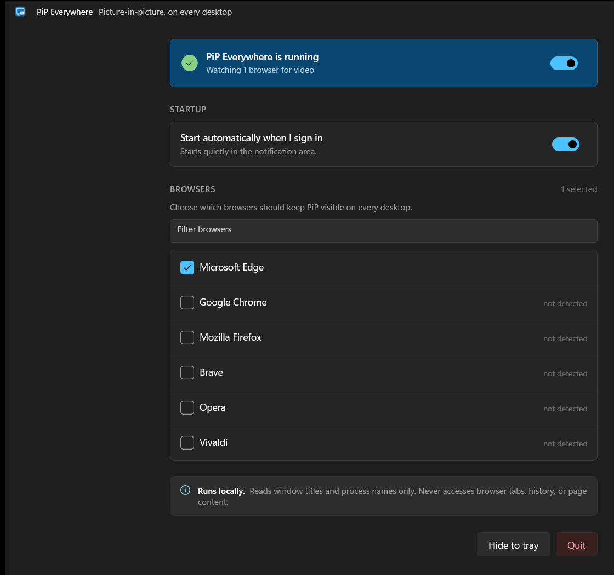

# PiP Everywhere

A small WinUI 3 utility that keeps browser picture-in-picture windows visible
across every Windows virtual desktop without pinning the browser itself.



## Features

- Supports Edge, Chrome, Firefox, Brave, Opera, and Vivaldi.
- Starts at sign-in and runs quietly in the notification area.
- Can be paused instantly or limited to selected browsers.
- Runs locally and never reads tabs, history, URLs, or page content.

## Install

Download the x64 or ARM64 installer from
[GitHub Releases](https://github.com/aasimkhan30/pip-everywhere/releases).
The GitHub build uses a persistent self-signed certificate that must be trusted
once. Microsoft Store installations are Store-signed and update automatically.

Requires Windows 11 24H2 or newer.

## Build

```powershell
dotnet build .\PiPEverywhere.slnx -c Release
dotnet test .\tests\PiPEverywhere.Tests\PiPEverywhere.Tests.csproj -c Release
```

The app uses an unofficial Windows virtual-desktop API and may require
compatibility updates after major Windows releases.

## License

MIT. See [THIRD-PARTY-NOTICES.md](THIRD-PARTY-NOTICES.md).
